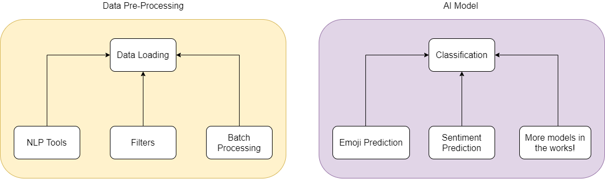

.. Murphy documentation master file, created by
   sphinx-quickstart on Mon Mar  1 22:18:26 2021.
   You can adapt this file completely to your liking, but it should at least
   contain the root `toctree` directive.

Murphy
======

*Murphy is a text processing library for working with Twitter data, built on top of Dask*

Murphy is broken down into several components and subcomponents:

 - **Data Preprocessing**: Creating scalable tools for helping researchers moving forward

   - *NLP Tools*: NLP cleaning tools for *tokenization* and *Lemmatisation*

   - *Filters*: Removing retweet strings, emojis, and other annoyances

   - *Batch Processing*: Applying batch based workloads to make data processing easier

 - **Applying AI Models**: Creating AI models built by us for various purposes

   - *Sentiment Analysis*: Predicting sentiments in tweets!

   - *Emoji Prediction*: Predicting which emojis would work best for a tweet (coming soon!)

   - *And more!* We're still developing, so ideas and contributions are much appreciated!

Built on top of Dask
--------------------

By building on top of Dask, we're able to get massive performance boosts and scalability.

You also have access to individual Dask objects like Dask DataFrames and Dask Bags directly, so you can continue to experiment on your own after using our tools.

.. toctree::
   :maxdepth: 1
   :caption: Getting Started

   installation
   quick-start

